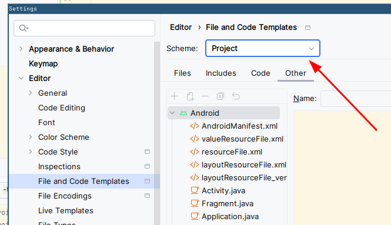
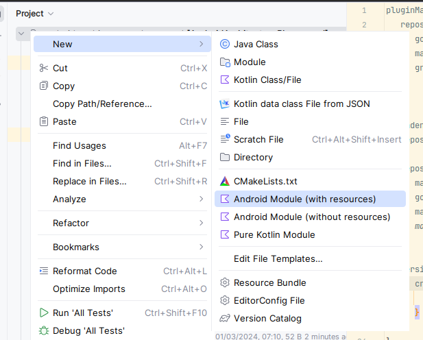

# Kotlinova architecture demo

Playground / demo app for using Kotlinova architecture. It is simple app that loads data from https://dummyjson.com.
Features include:

* 100% Compose (single activity)
* Deep links to every screen
* Configuration change and process deaths handling
* Dark mode support
* Material You support
* Improved support for large screens (two-pane layout for user and post list)
* Offline support (data is saved to database and can be browsed offline)
* Pagination
* List of all reusable Compose components in-app (via Showkase)
* Unit tests for UI and all logic code
* Integration tests that test the whole app, optimized with R8
* Easy to use screenshot tests
* Macrobenchmark

See also other branches:

* `empty_kotlinova_project` = Empty template project with most of the kotlinova architecture set up
* `empty_project` = Barebones empty project with some essentials pre-created

# Readme for the application

## Checking out project

1. Install [Git LFS](https://git-lfs.com/)
2. Checkout the repo
3. Run `git lfs fetch` in the repo

## Updating versions

Process for updating all library versions::

1. Open `libs.toml` file and check if any versions marked with `@pin` have been unblocked and can now be updated
2. Run `./gradlew versionCatalogUpdate`.
3. Update Gradle version
    1. Find latest version and the checksum for -all version from https://gradle.org/release-checksums/
    2. Run `./gradlew wrapper --gradle-version VERSION --gradle-distribution-sha256-sum SHA`, where you
       substitute `VERSION` and `SHA` with the info found in the previous step.
4. Sync the project, build the app and run all tests to make sure everything still works.
5. Run `detektDebug` gradle task to find any new deprecated code
6. For any new deprecated code found by the search:
    * If the fix is trivial, fix it immediately as part of the update commit
    * Otherwise, make a tech debt ticket and add a @Suppress with the ticket number
      (and/or discuss with the team how to address it)

## Creating a new module

To easily add new modules, first enable project templates (you only need to do this once).
Open Android Studio's Settings, go to "File and Code Templates" and set Scheme to "Project".

Then, to create a new module:

1. Right click on the root in the project window, select New and then the project type you want
  
2. Add module to `settings.gradle.kts`
3. Add module to app's `build.gradle.kts` as `implementation(projects.newModule)`)
4. Remove leading space from all generated ` .gitignore` files (workaround for the https://youtrack.jetbrains.com/issue/IJPL-2568)

## Hierarchy of the feature modules

Every feature should contain following modules:

* `feature-name`
    * `data` - data module with all non-UI logic (such as repositories).
      No other `data` or `ui` module should depend on this (except for tests).
    * `api` - interfaces and data models exposed to other modules.
      This module should generally contain no logic to speed up builds.
    * `ui` - Module containing feature's ui (Screens / Fragments / ViewModels).
      No other `data` or `ui` module should depend on this (except for tests).
    * `test` (optional) - Module containing test helpers for faking stuff exposed in the `api` module

## Running integration tests

`./gradlew :app:connectedAndroidTest -PtestAppWithProguard`

# Creating screenshot tests

To create screenshot tests for your compose screen:

1. Make preview functions public
2. Add `showkase` plugin to the module of the screen you want to test
2. Add `@ShowkaseComposable(group = "Test")` annotation to the preview of the screen you want to test
3. run `recordPaparazziDebug` gradle task to record golden screenshot
   (double check that only previews for your screen were generated)
