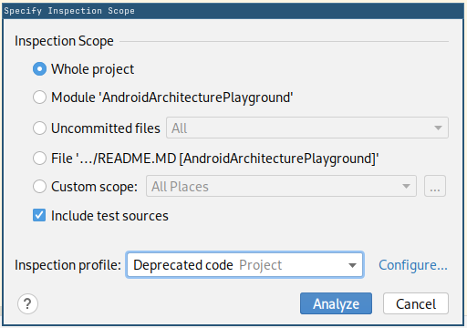

# Navigation playground

Playground for the creation of the StabbyStack navigation system (Stabby = dagger, Stack = Simple stack).

## Updating versions

Process for updating all library versions::

1. Run `./gradlew dependencyUpdates :buildSrc:dependencyUpdates --no-configuration-cache > /dev/null &&  ./gradlew :app:updateLibsToml`. This will check for new versions of all libraries 
   and automatically bump versions inside `libs.toml`.
2. Check the output of the above task and manually update any libraries that task said it couldn't update automatically.
2. Sync the project, build the app and run all tests to make sure everything still works.
3. Open Code -> Analyze code dialog, and scan the whole project with the "Deprecated code" profile:
   
4. For any new deprecated code found by the search:
    * If the fix is trivial, fix it immediately as part of the update commit
    * Otherwise, make a tech debt ticket (and/or discuss with the team how to address it) 
